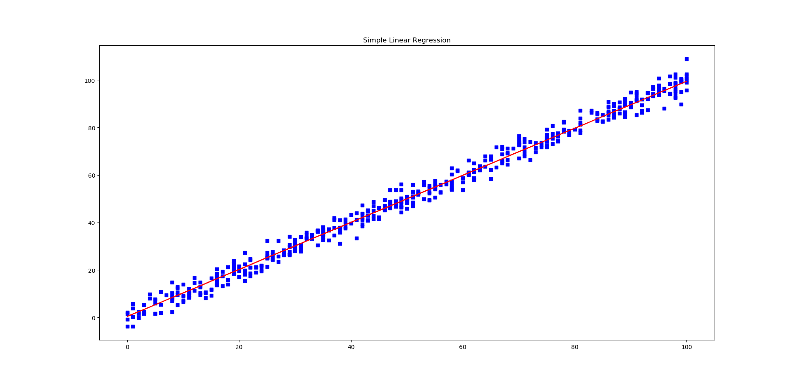

# sklearn
Trying to implement Scikit Learn for Python in C++

#### PREPROCESSING:
1. [Standardization](https://github.com/VISWESWARAN1998/sklearn#standardization)
2. [Normalization](https://github.com/VISWESWARAN1998/sklearn#normalization)
3. [Label Encoding](https://github.com/VISWESWARAN1998/sklearn#label-encoding)


#### REGRESSION:
1. [Least Squares Regression](https://github.com/VISWESWARAN1998/sklearn#least-squares-regressionsimple-linear-regression)

#### CLASSIFIFCATION:
1. [Gaussian Naive Bayes](https://github.com/VISWESWARAN1998/sklearn#classification---gaussian-naive-bayes)


#### STANDARDIZATION

**SOURCE NEEDED:** preprocessing.h, proecessing.cpp and statx.h <br/>

StandardScaler will standardize features by removing the mean and scaling to unit variance. _ref:_ [Scikit Learn docs](https://scikit-learn.org/stable/modules/generated/sklearn.preprocessing.StandardScaler.html)

```c++
// SWAMI KARUPPASWAMI THUNNAI

#include <iostream>
#include "preprocessing.h"

int main()
{
	StandardScaler scaler({0, 0, 1, 1});
	std::vector<double> scaled = scaler.scale();
	// Scaled value and inverse scaling
	for (double i : scaled)
	{
		std::cout << i << " " << scaler.inverse_scale(i) << "\n";
	}
}
```

#### NORMALIZATION:

**SOURCE NEEDED:** preprocessing.h, proecessing.cpp and statx.h

```c++
// SWAMI KARUPPASWAMI THUNNAI

#include <iostream>
#include "preprocessing.h"

int main()
{
	std::vector<double> normalized_vec = preprocessing::normalize({ 800, 10, 12, 78, 56, 49, 7, 1200, 1500 });
	for (double i : normalized_vec) std::cout << i << " ";
}
```

#### LABEL ENCODING:

**SOURCE NEEDED:** preprocessing.h and preprocessing.cpp

Label encoding is the process of encoding the categorical data into numerical data. For example if a column in the dataset contains country values like GERMANY, FRANCE, ITALY then label encoder will convert this categorical data into numerical data like this

country - categorical |country - numerical
-------------------|-------------------
GERMANY | 1
FRANCE | 0
ITALY | 2

_Example code:_

```c++
// SWAMI KARUPPASWAMI THUNNAI

#include <iostream>
#include <string>
#include "preprocessing.h"

int main()
{
	std::vector<std::string> categorical_data = { "GERMANY", "FRANCE", "ITALY" };
	LabelEncoder<std::string> encoder(categorical_data);
	std::vector<unsigned long int> numerical_data = encoder.fit_transorm();
	for (int i = 0; i < categorical_data.size(); i++)
	{
		std::cout << categorical_data[i] << " - " << numerical_data[i] << "\n";
	}
}
```

#### Label Binarization:

```c++
// SWAMI KARUPPASWAMI THUNNAI

#include <iostream>
#include <string>
#include "preprocessing.h"

int main()
{
    std::vector<std::string> ip_addresses = { "A", "B", "A", "B", "C" };
    LabelBinarizer<std::string> binarize(ip_addresses);
    std::vector<std::vector<unsigned long int>> result = binarize.fit();
    for (std::vector<unsigned long int> i : result)
    {
        for (unsigned long int j : i) std::cout << j << " ";
        std::cout << "\n";
    }
    // Predict
    std::cout << "Prediction:\n-------------\n";
    std::string test = "D";
    std::vector<unsigned long int> prediction = binarize.predict(test);
    for (unsigned long int i : prediction) std::cout << i << " ";
}
```


#### LEAST SQUARES REGRESSION(SIMPLE LINEAR REGRESSION)

**HEADERS NEEDED:** lsr.h and lsr.cpp

_Creating new model and saving it:_<br/>

**DATASET:**

X|y
-|--
2|4
3|5
5|7
7|10
9|15

```c++
// SWAMI KARUPPASWAMI THUNNAI

#include "lsr.h"

int main()
{
	// X, y, print_debug messages
	simple_linear_regression slr({2, 3, 5, 7, 9}, {4, 5, 7, 10, 15}, DEBUG);
	slr.fit();
	std::cout << slr.predict(8);
	slr.save_model("model.txt");
}
```


Loading existing model

```c++
// SWAMI KARUPPASWAMI THUNNAI

#include "lsr.h"

int main()
{
	// X, y, print_debug messages
	simple_linear_regression slr("model.txt");
	std::cout << slr.predict(8);
}

```

**SAMPLE PREDICTION PLOTTED:**



#### Multiple Linear Regression:

Training and saving the model

```c++
// SWAMI KARUPPASWAMI THUNNAI

#include <iostream>
#include "mlr.h"

int main()
{
	LinearRegression mlr({ {110, 40}, {120, 30}, {100, 20}, {90, 0}, {80, 10} }, {100, 90, 80, 70, 60}, NODEBUG);
	mlr.fit();
	std::cout << mlr.predict({ 110, 40 });
	mlr.save_model("model.json");
}
```

Loading the saved model

```c++
// SWAMI KARUPPASWAMI THUNNAI

#include <iostream>
#include "mlr.h"

int main()
{
	// Don't use fit method here
	LinearRegression mlr("model.json");
	std::cout << mlr.predict({ 110, 40 });
}
```


#### Classification - Gaussian Naive Bayes

Classification male - female using height, weight, foot size and saving the model.

**HEADERS / SOURCE NEEDED:** naive_bayes.h, naive_bayes.cpp, json.h

```c++
// SWAMI KARUPPASWAMI THUNNAI

#include "naive_bayes.h"

int main()
{
	gaussian_naive_bayes nb({ {6, 180, 12}, {5.92, 190, 11}, {5.58, 170, 12}, {5.92, 165, 10}, {5, 100, 6}, {5.5, 150, 8}, {5.42, 130, 7}, {5.75, 150, 9} }, { 0, 0, 0, 0, 1, 1, 1, 1 }, DEBUG);
	nb.fit();
	nb.save_model("model.json");
	std::map<unsigned long int, double> probabilities = nb.predict({ 6, 130, 8 });
	double male = probabilities[0];
	double female = probabilities[1];
	if (male > female) std::cout << "MALE";
	else std::cout << "FEMALE";
}
```

_Loading a saved model:_

```c++
// SWAMI KARUPPASWAMI THUNNAI

#include "naive_bayes.h"

int main()
{
	gaussian_naive_bayes nb(NODEBUG);
	nb.load_model("model.json");
	std::map<unsigned long int, double> probabilities = nb.predict({ 6, 130, 8 });
	double male = probabilities[0];
	double female = probabilities[1];
	if (male > female) std::cout << "MALE";
	else std::cout << "FEMALE";
}
```
